# Analysis of Schools (Elementary, Middle, High) in San Diego Neighborhoods 

----------------------------------------------------------------------------------------------------------------------------------------

## Introduction

I live in San Diego, CA.
So, i've decided to explore and analyze neighborhoods in this wonderful city to understand, is it any correlation between median household income and amount of schools in this neighborhood.

The main question is:

# Does it mean that in the richest neighborhoods more and better schools (Elementary, Middle, High) than in Poorest Neighborhoods?

---------------------------------------------------------------------------------------------------------------------------------------

### Target Audience:

* Families with kids, who moving in in San Diego. They know their income, they want their kids to go to the right school, so this will help them to find right place.
* Budding Data Scientists, who wants to implement some of the most used Exploratory Data Analysis techniques to
obtain necessary data, analyze it and, finally be able to tell a story out of it.

----------------------------------------------------------------------------------------------------------------------------------------

# Initial Data Preparation:

## GeoJSON file

I found the great GeoJSON file [Zillow Neighborhoods](https://data.opendatasoft.com/explore/dataset/zillow-neighborhoods%40public/information/) that consists of all USA Neighborhoods with latitude and longitude information. 
After filtering and cleaning data we get dataframe with all neighborhoods in San Diego City (NOT COUNTY!).

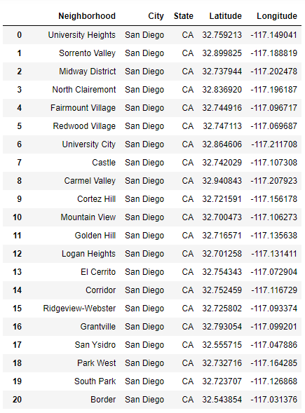


## Web-Scrapping 

Then we scraped [Richest Neighborhoods In San Diego For 2020](https://www.homesnacks.net/richest-neighborhoods-in-san-diego-129013/) using **Beautiful Soup** library. This web page represents "List Of The Richest Neighborhoods In San Diego For 2020". 

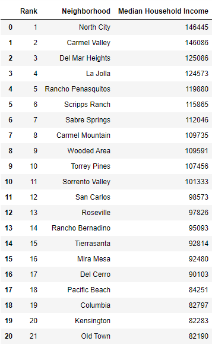

## Completed San Diego Neighborhoods Data Frame

I had to merge 2 above dataframes to get final dataframe that we will work with.

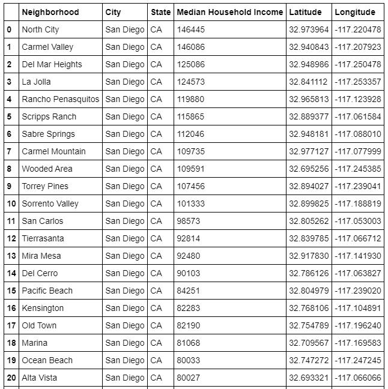

----------------------------------------------------------------------------------------------------------------------------------------

Using `folium` library we can vizualise all Neighborhoods on the map.

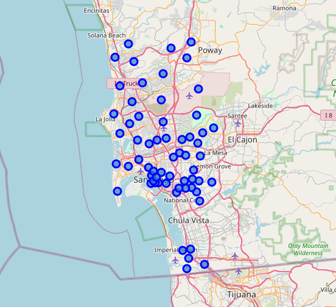

After manipulation with data we create 2 separate dataframes: 10 Richest Neighborhoods and 10 Poorest Neighborhoods and plot them on the map.

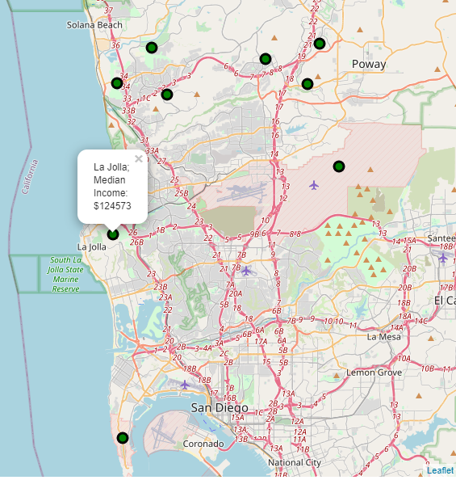

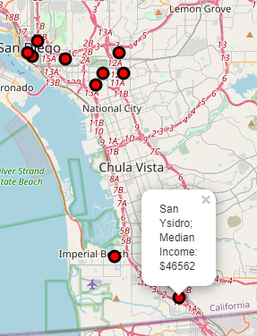

**We can see, the Poorest Neighborhoods located closer to Downtown and near Mexico border, the Richest are close to the ocean and north of all other neighborhoods.*

----------------------------------------------------------------------------------------------------------------------------------------

## Foursquare Data

Finally, I make use of Foursquare API to obtain the limit of 200 most common schools (Elementary, Middle and High) within 2 kilometer (1.25 miles) of each Richest and Poorest Neighborhood.

# Exploring the School Data and Neighborhood of San Diego

From the Foursquare data, There are 95 schools in Richest Neighborhoods in radius of 2000 meters (1.25 miles) and 78 schools in Poorest Neighborhoods in radius of 2000 meters (1.25 miles).

I have used `Folium` library to plot a leaflet map of only these schools in Richest and Poorest Neighborhoods which are as shown below.

### Schools in Richest Neighborhoods:

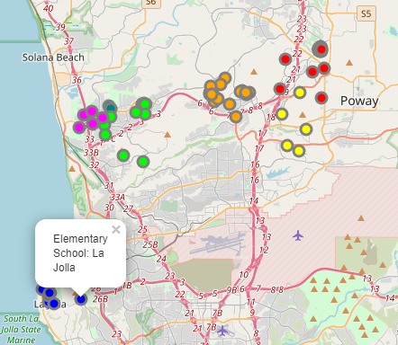

### Schools in Poorest Neighborhoods:

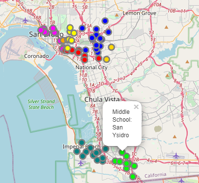

## Here we have found out that:
```
Amount of Schools in Richest Neighborhoods:

    High School          59
    Elementary School    27
    Middle School        9

Amount of Schools in Poorest Neighborhoods:

    Elementary School    52
    High School          16
    Middle School        10
```

Using `seaborn` and `matplotlib` libraries let's vizualise this information.

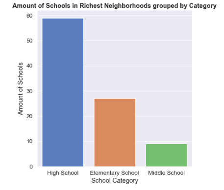
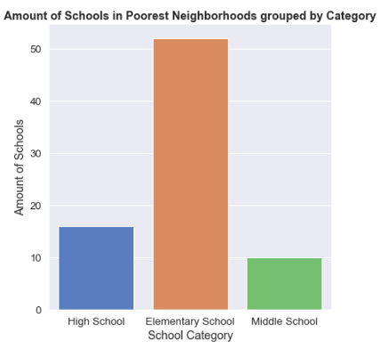

**Next step was to obtain information about the school categories of each neighborhood. And to do that, I proceed as follows**

* Create a data-frame with pandas one hot encoding for the school categories.

* Use pandas groupby on Neighborhood column and obtain the mean. 

* Transpose the data-frame at step 2 and arrange in descending order.

Implementing them in Pandas outputs the following:

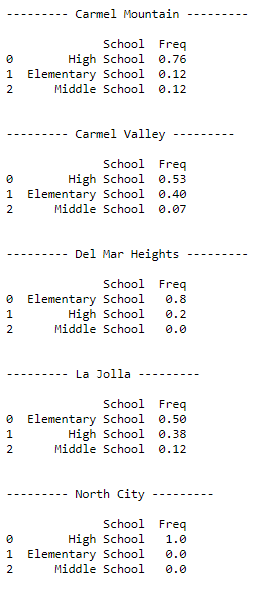
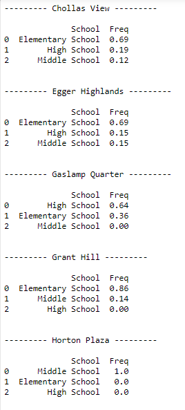

**Also I wanted to explore which neighborhood has the highest amount of schools and the plot below is the answer**

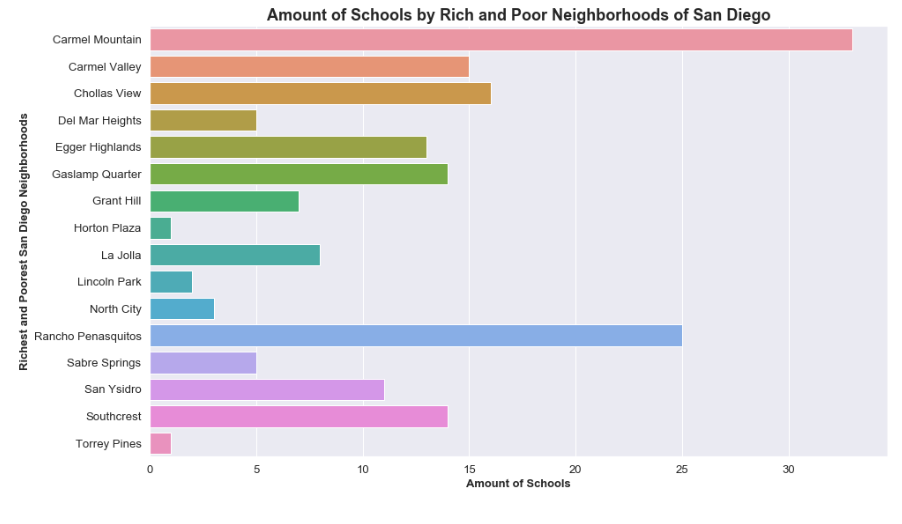

----------------------------------------------------------------------------------------------------------------------------------------

# Clustering the Richest and Poorest San Diego Neighborhoods 

Finally, we try to cluster Richest and poorest neighborhoods based on the frequency of school categories and, use K-Means clustering. So our expectation would be based on the similarities of school categories, these neighborhoods will be clustered. `Using K-Means algorithm from Scikit-learn library` we obtain 3 clusters as shown below.

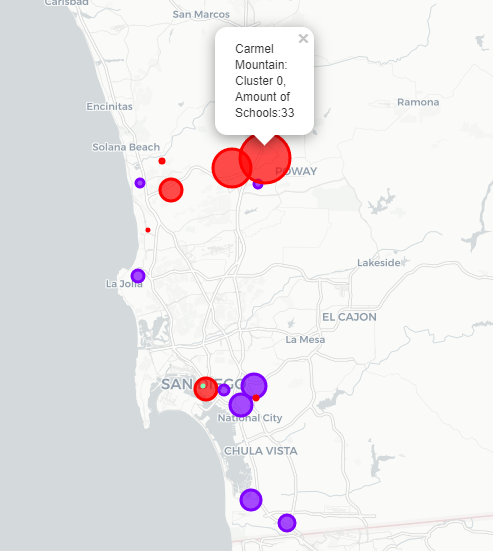

Here the **radius of the circles represent the amount of schools.** The color represesnts clusters (


